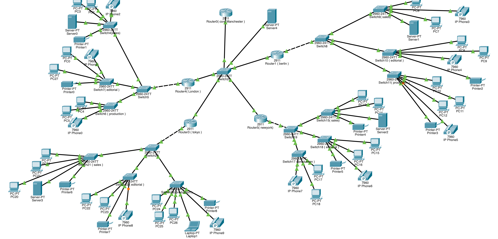

# 🌍 Global Enterprise Network Design (Cisco Packet Tracer)

## 📌 Project Overview
This project demonstrates the design and implementation of a multi-branch enterprise network using Cisco Packet Tracer. The network simulates a multinational company with branches in London, Berlin, New York, and Tokyo, connected to a central core network in Manchester.

## 🏢 Network Architecture
- Core Router (Manchester)
- Branch Routers (London, Berlin, New York, Tokyo)
- Department-based VLAN segmentation:
  - VLAN 10 – Sales
  - VLAN 20 – Editorial
  - VLAN 30 – Production

## ⚙️ Key Features Implemented
- Inter-VLAN Routing (Router-on-a-Stick)
- OSPF Dynamic Routing
- DHCP (Automatic IP Assignment)
- DNS & Web Server Configuration
- Access Control Lists (ACLs)
- VLAN & Trunking
- Multi-branch connectivity

## 🌐 Technologies Used
- Cisco Packet Tracer
- Networking Protocols (OSPF, DHCP, DNS)
- VLAN Segmentation
- Routing & Switching

## 🧠 Network Design Highlights

- Hierarchical network design (Core + Branch architecture)
- Department-based segmentation using VLANs
- Scalable WAN design using /30 subnetting
- Centralized services (DNS, Web Server)
- Dynamic routing with OSPF

## 📷 Project Screenshots

## ▶️ How to Run

1. Open the '.pkt' file using Cisco Packet Tracer
2. Start simulation mode (optional)
3. Test connectivity using:
   - ping between branch PCs
   - access web server via browser

## 🚀 Author
Rohith Prakash
